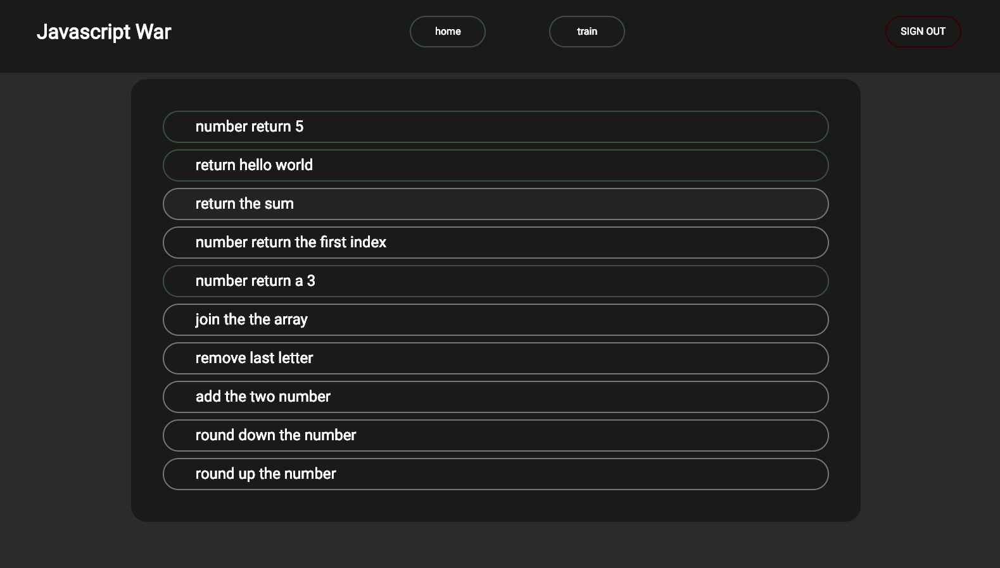
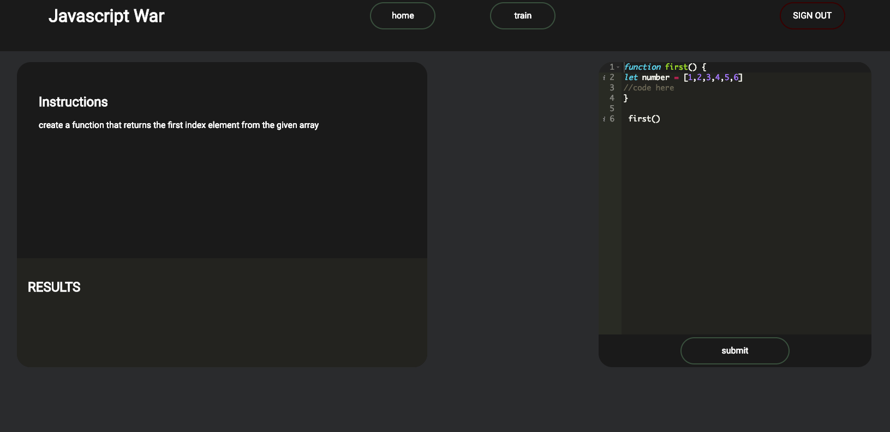
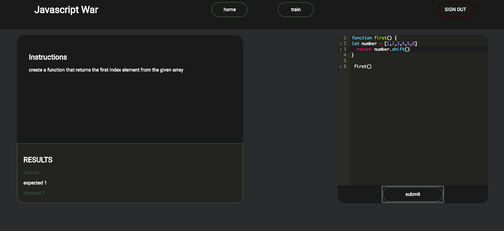

# Memoize





## Descriptions:

Web application that helps people practice and strengthen their skills in JavaScript with a competitional edge.


## Getting Started:

These instructions will get a copy of the project up and running on your local machine for usage and testing purposes. 

clone down the repository:
```
$ git clone https://github.com/Inzurriaga/Memoize-Two.git
```

cd into directory and run npm install:
```
$ npm install
```

launch in your browser:
```
$ npm start
```

## Project Tools:
HTMl
Javascript
CSS
React
Sass
Ace-react 

## Future Development and Extensions Notes:
Add more questions
not use the eval method to run code
give user more control over their account - setting page

## Original Assignment
[Memoize, Mod 2 at the Turing School of Software and Design](http://frontend.turing.io/projects/memoize.html)

## Contributors
Gabriel Inzurriaga: https://github.com/Inzurriaga
